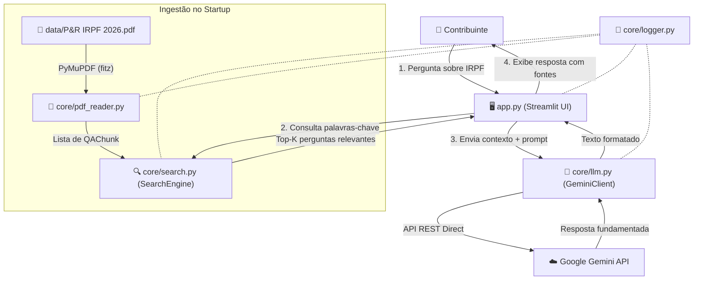

# 🦁 Leão IRPF Agent — Assistente Virtual Tributário IRPF 2026


Assistente virtual baseado em Inteligência Artificial para tirar dúvidas sobre a **Declaração do Imposto de Renda Pessoa Física (IRPF 2026)** com base estrita no documento oficial "Perguntas e Respostas IRPF 2026" publicado pela Receita Federal do Brasil.

Projeto desenvolvido para o **Challenge Alura Agente (ONE — Oracle Next Education)**.

---

## 📋 Sumário
- [1. Visão Geral](#1-visão-geral)
- [2. Arquitetura do Sistema](#2-arquitetura-do-sistema)
- [3. Tecnologias Utilizadas](#3-tecnologias-utilizadas)
- [4. Instruções de Execução Local](#4-instruções-de-execução-local)
- [5. Exemplos de Perguntas e Respostas](#5-exemplos-de-perguntas-e-respostas)
- [6. Evidência de Deploy (OCI)](#6-evidência-de-deploy-oci)
- [7. Licença e Autoria](#7-licença-e-autoria)

---

## 1. Visão Geral

O **Leão IRPF Agent** foi concebido com foco em confiabilidade, transparência e segurança da informação tributária. O sistema realiza busca semântica em nível de pergunta/resposta no documento oficial da Receita Federal e sintetiza respostas claras e objetivas utilizando o modelo **Google Gemini**, sempre citando a pergunta oficial (ex: `Pergunta 035`) de onde a informação foi extraída.

### Destaques do Projeto
- **100% Original:** Desenvolvido do zero com código limpo, tipado e modular.
- **RAG Nativo Leve:** Sem uso de bancos de vetores pesados (sem ChromaDB/FAISS), garantindo startup instantâneo.
- **Integração REST Direta:** Comunicação direta com a API do Gemini via REST HTTP sem dependência de SDKs legados.
- **Observabilidade Integrada:** Logs estruturados divididos entre rotina operacional (`logs/app.log`) e erros (`logs/error.log`).

---

## 2. Arquitetura do Sistema



---

## 3. Tecnologias Utilizadas

| Componente | Tecnologia | Finalidade |
|---|---|---|
| **Linguagem** | Python 3.10+ | Linguagem principal do projeto |
| **Interface** | Streamlit 1.42 | Frontend reativo e amigável |
| **Leitor de PDF** | PyMuPDF (fitz) | Extração rápida com correção de encoding |
| **IA / LLM** | Google Gemini API (REST) | Síntese de respostas fundamentadas |
| **Logging** | Python `logging` nativo | Rastreabilidade e diagnósticos em arquivo |

---

## 4. Instruções de Execução Local

### Pré-requisitos
- Python 3.10 ou superior instalado.
- Chave de API da Google Gemini (obtida gratuitamente no [Google AI Studio](https://aistudio.google.com/)).

### Passo a Passo

1. **Clonar o repositório:**
   ```bash
   git clone https://github.com/marcelo-sales/IRPF-Agent-Challenge-Alura.git
   cd IRPF-Agent-Challenge-Alura
   ```

2. **Criar e ativar ambiente virtual (opcional, mas recomendado):**
   ```bash
   python -m venv .venv
   # Windows (PowerShell):
   .\.venv\Scripts\Activate.ps1
   # Linux/macOS:
   source .venv/bin/activate
   ```

3. **Instalar as dependências:**
   ```bash
   pip install -r requirements.txt
   ```

4. **Configurar as variáveis de ambiente:**
   Crie um arquivo `.env` na raiz do projeto baseado no `.env.example`:
   ```bash
   cp .env.example .env
   ```
   Edite o `.env` e insira sua `GEMINI_API_KEY`.

5. **Executar a aplicação:**
   ```bash
   python -m streamlit run app.py
   ```
   Acesse a aplicação no navegador em `http://localhost:8501`.

---

## 5. Exemplos de Perguntas e Respostas

### Exemplo 1: Obrigatoriedade
- **Pergunta:** *Quem está obrigado a apresentar a Declaração de Ajuste Anual em 2026?*
- **Resposta Esperada:** O agente cita os critérios de rendimentos tributáveis (acima do limite legal), bens e direitos, ganhos de capital, etc., informando explicitamente que os detalhes constam na **Pergunta 001** do manual da Receita Federal.

### Exemplo 2: Deduções com Instrução
- **Pergunta:** *Existe limite para dedução de despesas com instrução/educação?*
- **Resposta Esperada:** O agente explica o limite individual por educando e cita a **Pergunta 335** do documento oficial.

### Exemplo 3: Fora do Escopo
- **Pergunta:** *Como faço para escalar um time de futebol?*
- **Resposta Esperada:** O agente informa educadamente que responde exclusivamente sobre a Declaração do Imposto de Renda 2026 conforme o guia oficial da Receita Federal.

---

## 6. Evidência de Deploy (OCI)

> *Seção reservada para evidências do deploy na infraestrutura Oracle Cloud Infrastructure (OCI) / Streamlit Community Cloud.*

- **URL de Produção:** `https://irpf-agent.streamlit.app` (exemplo)
- **Status da Aplicação:** 🟢 Ativo

---

## 7. Licença e Autoria

Desenvolvido por **Marcelo Sales** para o **Challenge Alura Agente (ONE — Oracle Next Education)**.
Licença MIT.
